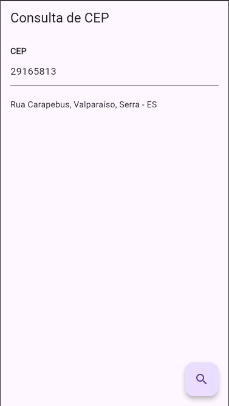

# Consulta CEP 📍

Aplicativo desenvolvido em Flutter com o objetivo de **consultar informações de um endereço a partir de um CEP informado pelo usuário**. Ele utiliza a API ViaCEP para buscar os dados, retornando informações como logradouro, bairro, cidade e estado. Essas informações vem através de um arquivo json.

## 🎯 Objetivo

O aplicativo tem como finalidade facilitar a consulta de endereços de forma rápida e prática, funcionando como um recurso auxiliar para validação de dados em sistemas de cadastro.

---

## 👥 Integrantes do grupo

- Davi Ramos Guedes
- Nicolas Speck
- Leonardo Lousada

---

## 📱 Captura de tela

Abaixo, uma imagem da tela principal do aplicativo, mostrando a recuperação das informações de um CEP:

## 🚀 Tecnologias utilizadas

- Flutter
- Dart
- API ViaCEP

## 📂 Estrutura do projeto

consultarcep/
├── lib/
│   ├── main.dart
│   └── ...
├── test/
│   └── widget_test.dart
├── assets/
│   └── screenshots/
│       └── tela_principal.png
├── pubspec.yaml
└── README.md

